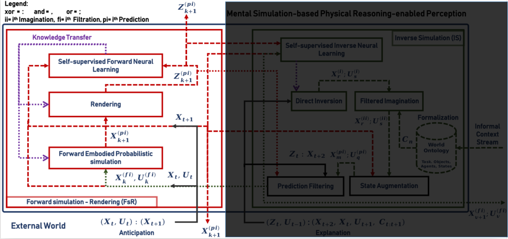

# forward_simulation_rendering
This module of [NaivPhys4RP](https://github.com/NaivPhys4RP/naivphys4rp/) anticipates the next state of the world as well as the observation of such state and is situtated in NaivPhys4RP's architecture as shown by the figure below:

</img>

